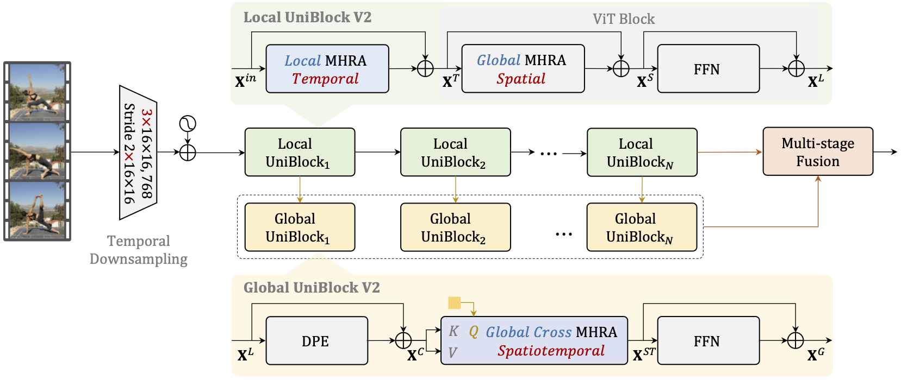
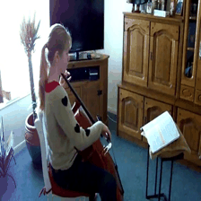

# UniFormerV2





[](https://twitter.com/search?q=%23FreePalestine&src=typed_query)

[](https://arxiv.org/abs/2211.09552) []([?](https://img.shields.io/badge/keras-2.12-darkred)) [](https://colab.research.google.com/drive/1Z6RzLcno_eLGD_E96mlWoyGieGbKxPQr?usp=sharing) [](https://huggingface.co/spaces/innat/UniFormerV2) [](?)

**UniFormerV2**, a generic paradigm to build a powerful family of video networks, by arming the pre-trained [**ViTs**](https://github.com/google-research/vision_transformer) with efficient [**UniFormer**](https://github.com/Sense-X/UniFormer) designs. It gets the state-of-the-art recognition performance on **8** popular video benchmarks, including scene-related [Kinetics-400/600/700](https://www.deepmind.com/open-source/kinetics) and [Moments in Time](http://moments.csail.mit.edu/), temporal-related [Something-Something V1/V2](https://developer.qualcomm.com/software/ai-datasets/something-something), untrimmed [ActivityNet](http://activity-net.org/) and [HACS](http://hacs.csail.mit.edu/). In particular, **it is the first model to achieve 90% top-1 accuracy on Kinetics-400.**

This is unofficial `keras` implementation of [**UniFormerV2: Spatiotemporal Learning by Arming Image ViTs with Video UniFormer.**](https://arxiv.org/abs/2211.09552). The official PyTorch code is [here](https://github.com/OpenGVLab/UniFormerV2).


## News

- **[20-10-2023]**: GPU(s), TPU-VM for fine-tune training are supported, [colab](https://github.com/innat/UniFormerV2/blob/main/notebooks/uniformerv2_video_classification.ipynb).
- **[19-10-2023]**: UFV2 checkpoints for [ActivityNet](http://activity-net.org/) and [HACS](http://hacs.csail.mit.edu/) becomes available, [link](https://github.com/innat/UniFormerV2/releases/tag/v1.0).
- **[18-10-2023]**: UFV2 checkpoints for [K710](https://github.com/OpenGVLab/UniFormerV2/blob/main/DATASET.md#kinetics-710) and [Moments in Time](http://moments.csail.mit.edu/) becomes available, [link](https://github.com/innat/UniFormerV2/releases/tag/v1.0).
- **[17-10-2023]**: UFV2 checkpoints for [SSV2](https://developer.qualcomm.com/software/ai-datasets/something-something) and [Kinetics-600/700](https://www.deepmind.com/open-source/kinetics) becomes available, [link](https://github.com/innat/UniFormerV2/releases/tag/v1.0).
- **[16-10-2023]**: UFV2 checkpoints for [Kinetics-400](https://www.deepmind.com/open-source/kinetics) becomes available, [link](https://github.com/innat/UniFormerV2/releases/tag/v1.0).
- **[15-10-2023]**: Code of UniFormerV2 (UFV2) in Keras becomes available.


# Install

```python
git clone https://github.com/innat/UniFormerV2.git
cd UniFormerV2
pip install -e . 
```

# Usage

The `UniFormerV2` checkpoints are available in both `SavedModel` and `H5` formats on total **8** datasets, i.e. [Kinetics-400/600/700/710](https://www.deepmind.com/open-source/kinetics), [Something Something V2](https://developer.qualcomm.com/software/ai-datasets/something-something), [Moments in Time V1](http://moments.csail.mit.edu/), [ActivityNet](http://activity-net.org/) and [HACS](http://hacs.csail.mit.edu/). The variants of this models are `base` and `large`. Each variants may have further variation for different number of input size and input frame. That gives around **35** checkpoints for UniFormerV2. Check this [release](https://github.com/innat/UniFormerV2/releases/tag/v1.0) and [model zoo](MODEL_ZOO.md) page to know details of it. Also check [`model_configs.py`](./model_configs.py) to get overall looks of avaiable model config. Following are some hightlights.

**Inference**

```python
from uniformerv2 import UniFormerV2

>>> model = UniFormerV2(name='K400_B16_8x224')
>>> model.load_weights('TFUniFormerV2_K400_B16_8x224.h5')
>>> container = read_video('sample.mp4')
>>> frames = frame_sampling(container, num_frames=8)
>>> y = model(frames)
>>> y.shape
TensorShape([1, 400])

>>> probabilities = tf.nn.softmax(y_pred_tf)
>>> probabilities = probabilities.numpy().squeeze(0)
>>> confidences = {
    label_map_inv[i]: float(probabilities[i]) \
    for i in np.argsort(probabilities)[::-1]
}
>>> confidences
```

A classification results on a sample from [Kinetics-400](https://www.deepmind.com/open-source/kinetics).

| Video                          | Top-5 |
|:------------------------------:|:-----|
|         | <pre>{<br>    'playing cello': 0.9992249011,<br>    'playing violin': 0.00016990336,<br>    'playing clarinet': 6.66150512e-05,<br>    'playing harp': 4.858616014e-05,<br>    'playing bass guitar': 2.0927140212e-05<br>}</pre> |


**Fine Tune**

Each videoswin checkpoints returns `logits`. We can just add a custom classifier on top of it. For example,

```python
from uniformerv2 import UniFormerV2

# import pretrained model, i.e.
model_name = 'ANET_L14_16x224'
uniformer_v2 = UniFormerV2(name=model_name)
uniformer_v2.load_weights(f'TFUniFormerV2_{model_name}.h5')
uniformer_v2.trainable = False

# downstream model
model = keras.Sequential([
    uniformer_v2,
    layers.Dense(
        len(class_folders), dtype='float32', activation=None
    )
])
model.compile(...)
model.fit(...)
model.predict(...)

```

# Model Zoo

The uniformer-v2 checkpoints are listed in [MODEL_ZOO.md](MODEL_ZOO.md). Following are some hightlights.


# TODO
- [x] Custom fine-tuning code.
- [ ] Publish on TF-Hub.
- [ ] Support `Keras V3` to support multi-framework backend.


##  Citation

If you use this videoswin implementation in your research, please cite it using the metadata from our `CITATION.cff` file.

```swift
@misc{li2022uniformerv2,
      title={UniFormerV2: Spatiotemporal Learning by Arming Image ViTs with Video UniFormer}, 
      author={Kunchang Li and Yali Wang and Yinan He and Yizhuo Li and Yi Wang and Limin Wang and Yu Qiao},
      year={2022},
      eprint={2211.09552},
      archivePrefix={arXiv},
      primaryClass={cs.CV}
}
```
